# Barrakes

## Introduction

This [PoS](https://en.wikipedia.org/wiki/Point_of_sale) was created to help our organization (we own a bar) to deal with 
all the orders during the gigs in our town. 

Due to COVID-19 reasons, the town hall did not let the concert attendees to stand up any time. They had to remain seated
all the time, thus being impossible to order directly at the bar counter. 

Thanks to this project we were able to provide our customers a URL to let them order the drinks/food they wanted, had an
admin view for our staff have a status control of the orders made, let the customers know about the status of their orders, and 
avoid being and item ordered when out of stock.

Because it is responsive, it works in both computers and mobile devices.

Due to our customers were catalan speakers the frontend is written in that language.

## Workflow

Customers:
1. Scan the QR code stuck in their chair that redirect them to our _new order_ URL.
2. Fill all the fields with the correct information:
    * seat number (each seat has a unique number on it).
    * select all the products.
    * choose a payment method.
        * Credit card
        * Cash + exact payment amount
    * Add a comment if needed.
3. Send the order
4. Once sent, the customer is redirected to a view where they can know the status of their order in real time.
        
In our bar (needs a staff user account):
* As soon as a customer finishes a new order a receipt is printed by our thermal printer. The receipt contains all the
information needed to prepare the order + the change to be given to the customer (only in the case the customer has
chosen 'cash' as the payment method).
* On web's dashboard a view of all the pending orders is shown. We can change the status of the orders to both
let the user know about the status and have a global vision of our processes.
* In case a product is sold out, we can disable that product and it will appear as 'sold out' when customers try to 
place a new order.
 
## Overview

The whole project consist in 3 servers:
* Web: contains the web code, database, dynamic dns update, nginx. All managed using `docker-compose`. It has an openvpn
client.
* [CUPS](https://en.wikipedia.org/wiki/CUPS): The server that manages our thermal printer job queue. It has the needed
drivers to install the printer ([see](https://scruss.com/blog/2015/07/12/thermal-printer-driver-for-cups-linux-and-raspberry-pi-zj-58/)). 
We used a raspberry pi. It has an openvpn client.
* VPN: A OpenVPN server where both Web and CUPS server connect to. You can follow any OpenVPN tutorial or even use a 
[dockerized image](https://github.com/kylemanna/docker-openvpn). IMPORTANT: you must assign a fixed IP (unless you have
a dynamic DNS for VPN clients) to the customers (see `ccd` and `ifconfig-push` on openvpn manual) to guarantee that the 
cups server have always the same IP and avoid problems. 

By having both web and cups server connected via VPN, we can print receipts from the web server directly to our printer. 
So, once a new order is placed, the web server adds a new job into the cups servers and the receipt is printed over VPN.

As it is quite complicated to print directly using ESC/POS we thought CUPS was a good solution.

IMPORTANT: The CUPS server must be placed inside the bar, with the thermal printer connected to it (USB). The other ones
can be deployed into a virtual machine, for example.

## Requirements

We assume that you have both VPN and CUPS servers ready.

We used AWS for the server:
 * EC2 t2.small for the web.
 * EC2 t2.micro for the VPN server.

We use [duckdns](https://www.duckdns.org/) to obtain a public DNS. You must have an account and an unused subdomain.

## Installation

This section will only show you how to deploy the web server.

1. Clone the repository 
2. Create a new environmental file (named `.env`) inside the root path of the repository cloned on the previous step. This file
 will be used by the `docker-compose`. It must contain the following information:
    ```bash
    DJANGO_SETTINGS_MODULE=barrakes.settings.production
    SECRET_KEY="YOUR_SUPER_SECRET_HERE"
    DUCKDNS_SUBDOMAIN=YOUR_DUCKDNS_SUBDOMAIN_HERE
    DUCKDNS_TOKEN=YOUR_DUCKDNS_TOKEN_HERE
    DOMAIN_NAME=YOUR_DUCKDNS_SUBDOMAIN_HERE.duckdns.org
    CHECK_DATABASE=true
    DJANGO_DB_ENGINE=django.db.backends.postgresql
    DB_NAME=YOUR_DESIRED_DB_NAME_HERE
    DB_USER=YOUR_DESIRED_DB_USER_HERE
    DB_PASSWORD=YOUR_DESIRED_DB_PASSWORD_HERE
    DB_HOST=db
    DB_PORT=5432
    PRINTER_NAME=YOUR_PRINTER_NAME_HERE
    PRINTER_CUPS_URL=YOUR_PRINTER_CUPS_URL_HERE
    ``` 
    It's important to say that the `PRINTER_NAME` will be the one found on CUPS server, and the 
    `PRINTER_CUPS_URL` is the one using the VPN IP given to our CUPS servers 
    (example: http://192.168.255.6:631/printers/receipt_printer , being 192.168.255.6 the VPN IP of our CUPS server)
3. `docker-compose up`

As it is configured in the nginx service of the docker-compose, the default port is 666. Change it if necessary.

## Screenshots

### Customer view

As we assume our customers will use the app using their phones (who brings a PC in a gig?), the following screenshots were
taken using the smartphone.

First the customer have to introduce their seat number. Then they can select the quantity of each desired product. As
shown in the image, if a product is out of stock the customer can not select it.

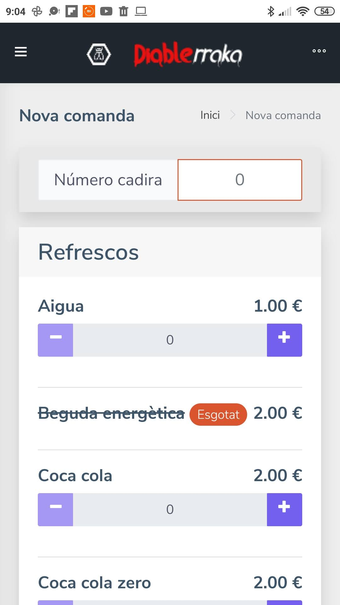

As they scroll down, they will find all the products available in our bar.

At the bottom, a summary of their order is shown. Then they have to chose their payment method. A comment can be added if 
necessary.

* Case credit card:

    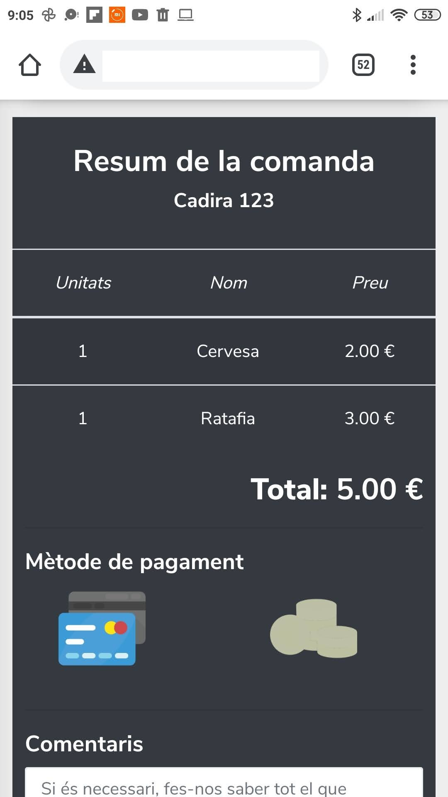

* Case cash:

    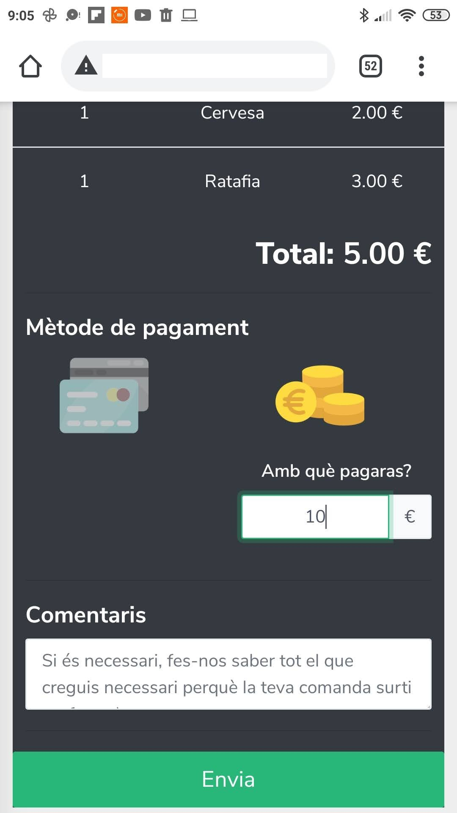 

Once the new order is sent, our customers are redirected into a view where they can see on real-time (using ajax) the status
of their orders.

* Status: received

    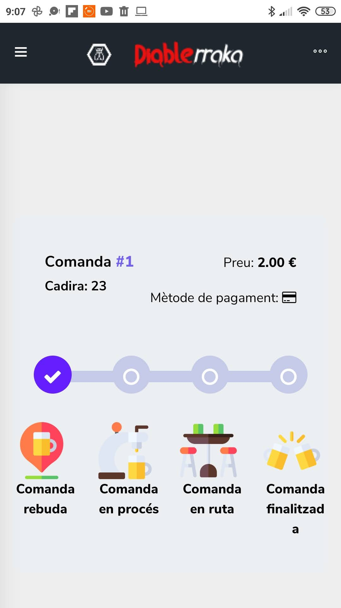

* Status: on going
    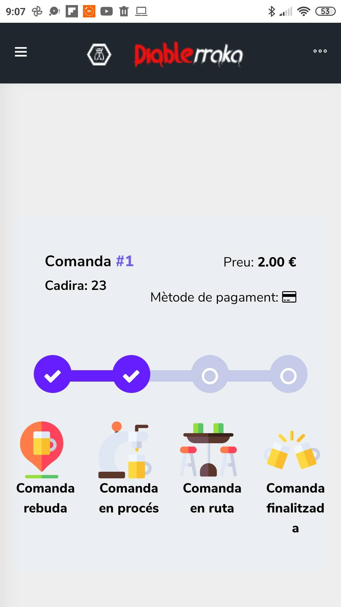
    
* Status: on delivery
    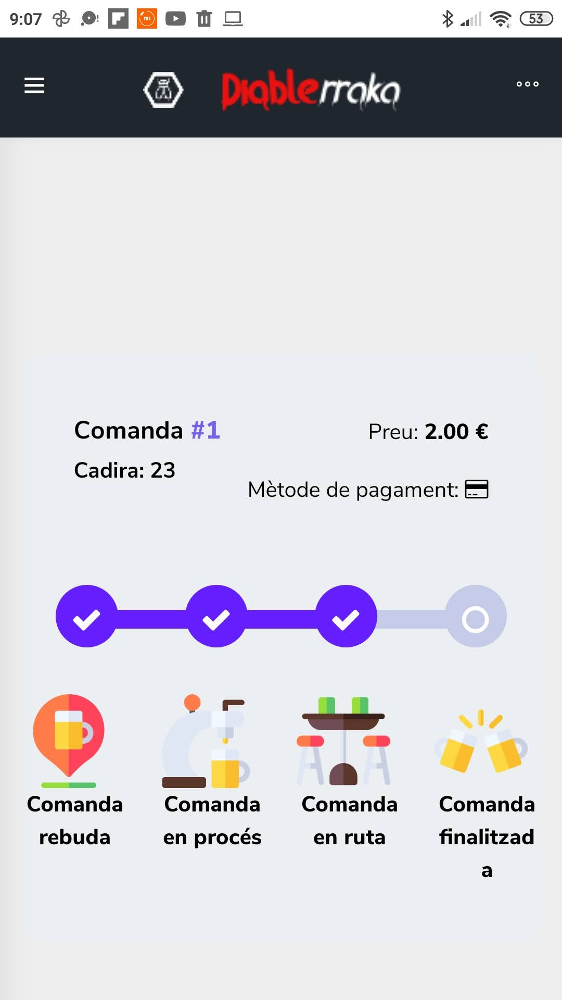
    
* Status: paid
    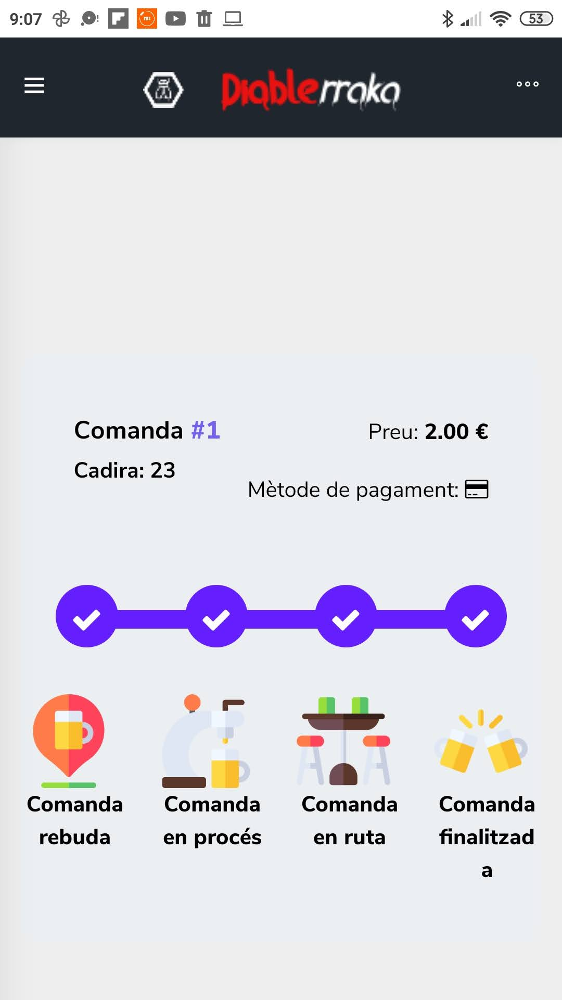
    
There is also a view for the status "cancelled", it shows a simple message with "CANCELLED" on it.

### Staff view

#### Dashboard

This is the main view to be used by the bar owner. It shows the lists of pending orders with some basic information + two
boxes on top with the number of total pending orders and total finished (paid) orders. Thanks to AJAX, this page is 
auto-refreshed to get the new orders without having to refresh the page manually.

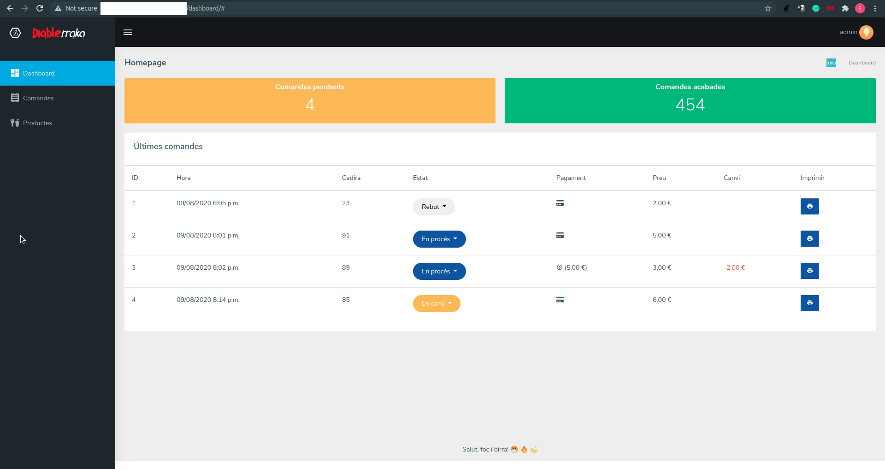

By using a dropdown list, the user can change the status of an order.

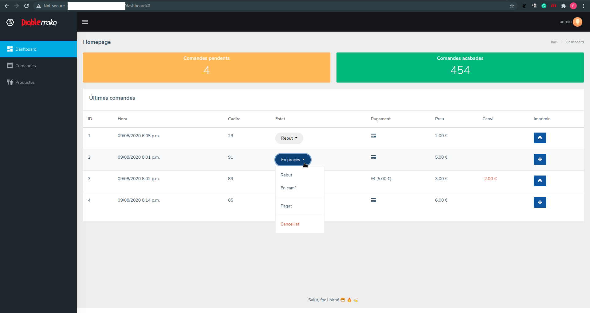

Or it can even see the full details of the order when clicking on its row.

* Case credit card as payment method:

    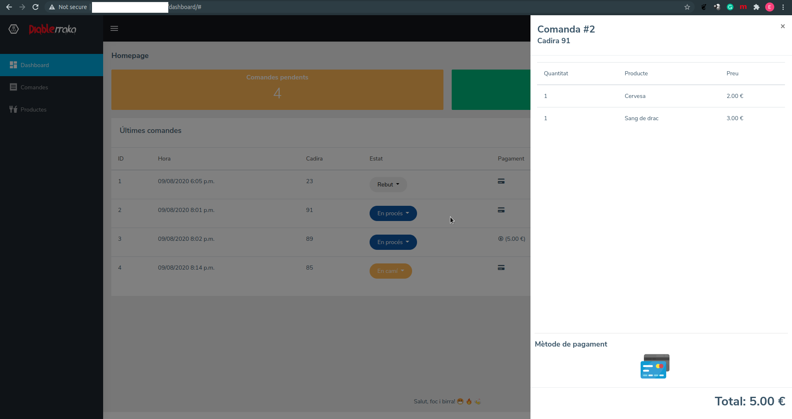

* Case cash as payment method: (it shows the payment amount and the change to be given)

    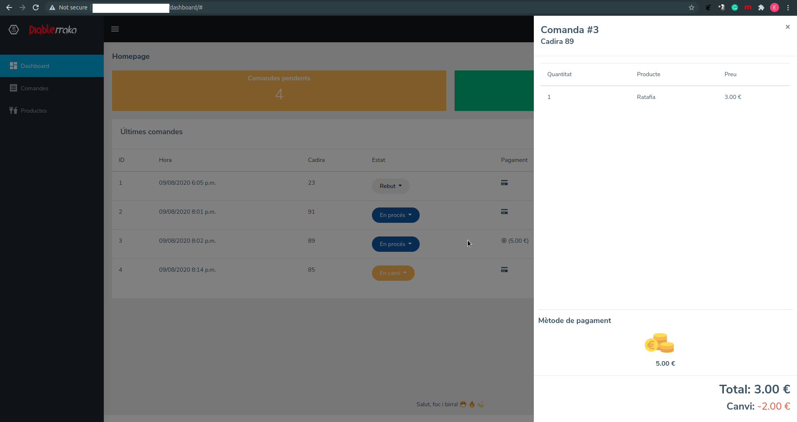

If the customer has added a message, it is shown in the modal as follows.

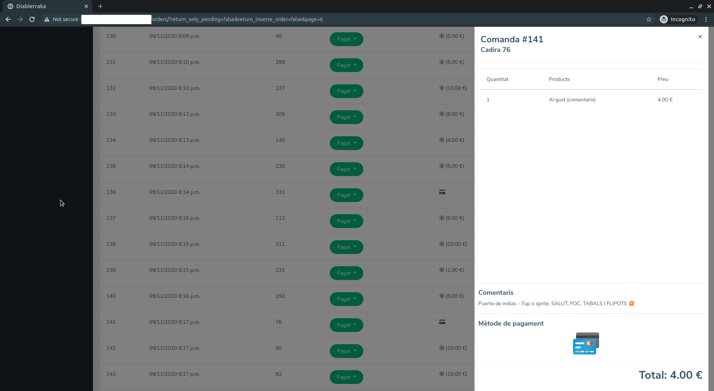

If the "printer" button is clicked, the receipt of that order is printed.

#### Orders view

It shows the same "order table" as in the dashboard view, with the only difference that here all orders are shown, independently 
of their status (in the dashboard only pending orders were displayed). In case of row click, same modal with information
is shown as in the dashboard.

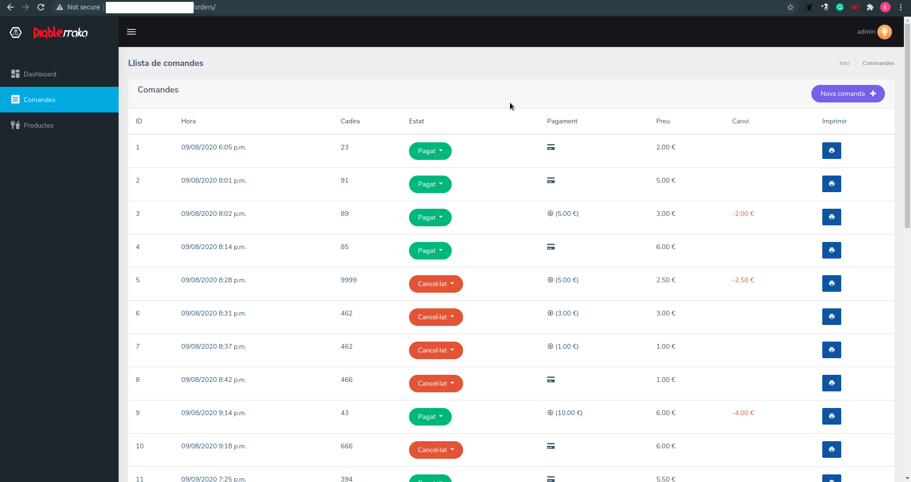

This view have pagination capabilities:

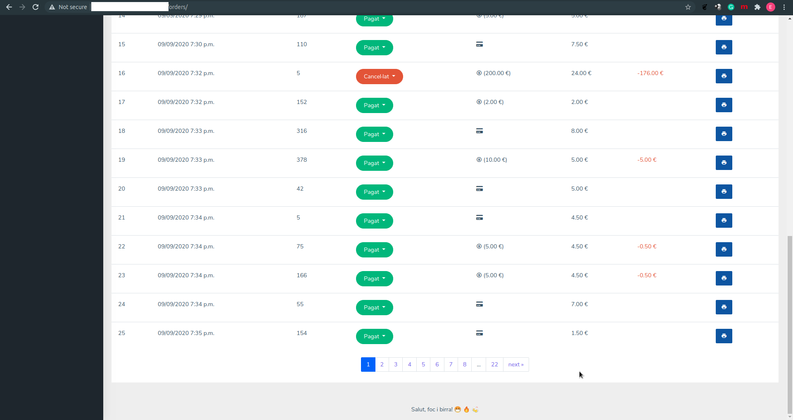 

If the "printer" button is clicked, the receipt of that order is printed.

#### Products view

In this view, the staff can set if a product is available or out of stock.

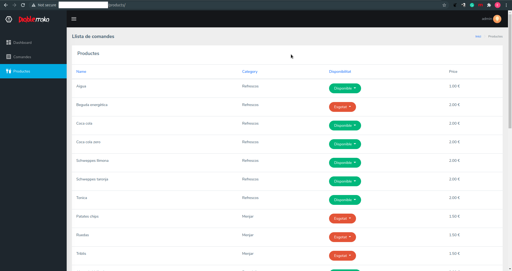

### Receipts

We have no screenshots of the receipts. We do have the HTML of the receipt that it is sent to CUPS in order to be printed
by the thermal printer in our bar.

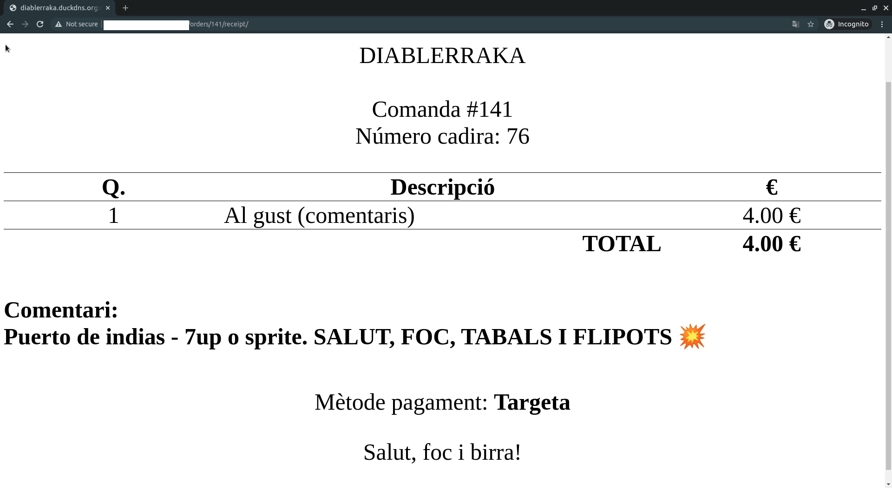

## TODO list

* Tests.
* Group templates better (general templates and app templates).
* Run dockerfile as non-root user.
* Review AJAX calls.
* modal with order info do not close sometime on mobile devices
* remove table-responsive for order's table. It makes the dropdown list not appear on mobile devices.
* use settings.CURRENCY for all templates.
* frontend in multiple languages
* set name of the app using environment variables.

## References

* https://medium.com/@christosstath10/create-your-own-point-of-sale-c25f8b1ff93b